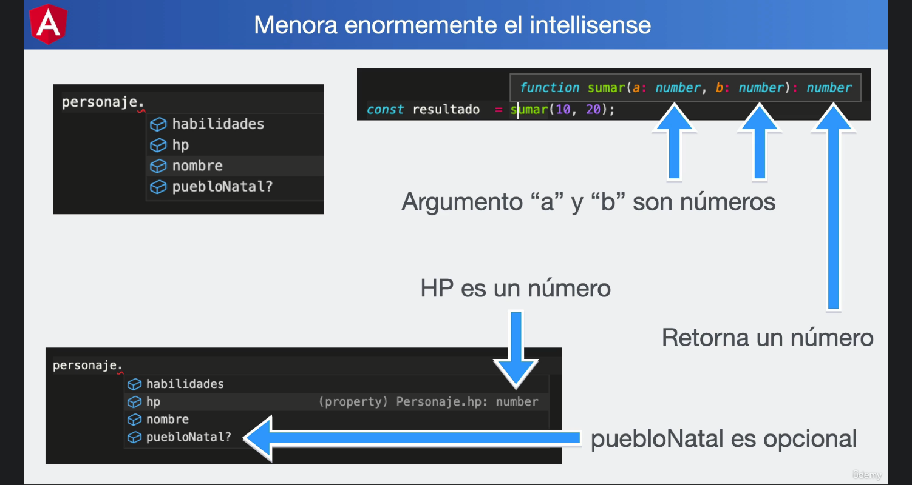

# ¿Qué veremos en esta sección?

Este es un breve listado de los temas fundamentales:

    Generalidades de TypeScript

    ¿Por qué Angular usa TypeScript?

    Mitos y realidades de Angular

Es una sección muy corta y teórica, pero necesitamos comprender estos temas para sobrepasar mitos e ideas erróneas que rodean el mundo de Angular.

## Ventajas de entendimiento de TS

## Decoradores
Le permiten a angular diferenciar cada una de las clases para identificar si se trata de algun tipo especial

