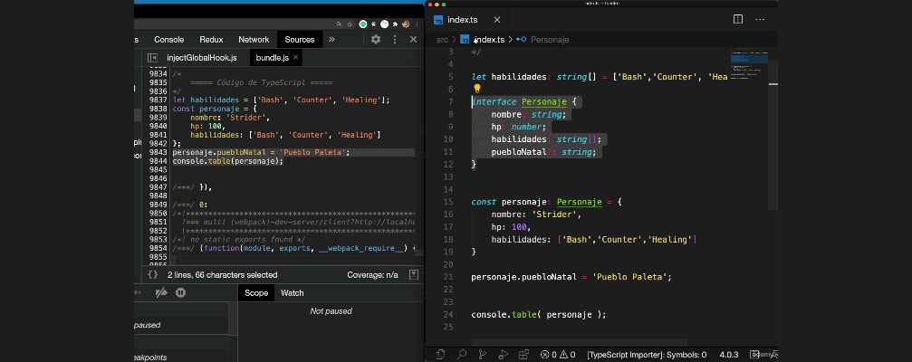

# ¿Qué veremos en esta sección?

Este es un breve listado de los temas fundamentales:

    Introducción a TypeScript

        Tipos básicos

        Objetos, arreglos e interfaces

        Funciones y sus argumentos

        Desestructuración de arreglos y objetos

        Importaciones y exportaciones

        Clases, constructores

        Tipos genéricos

        Decoradores

        Encadenamiento opcional

La idea de esta sección no es hacerlos expertos en TypeScript, pero sí irnos acostumbrando a la sintaxis y el tipado estricto de datos.

Después de la sección, podrán ver con otros ojos TypeScript y enfocarnos en todo lo que nos puede brindar, en lugar de las barreras que nos puede poner.

## Comenzando

Como primer paso es descargar la carpeta referente al 01-intro y descargar todas las dependencias empleando el comando `npm install`. Una vez que termine de instalar todas las dependencias podemos correr el comando `npm start` para que se levante el server sobre el puerto 8081.

El tipado de Typescript sólo se ve en el código, sin embargo, cuando se depliegue no veremos el tipado por ejemplo el `: string | boolean`

## Interfaces
El código que se implementa entre interfaces nunca llega a reflejarse en el navegador:

## Componentes

Cuando se crea un componente siempre debe ser importado en un módulo