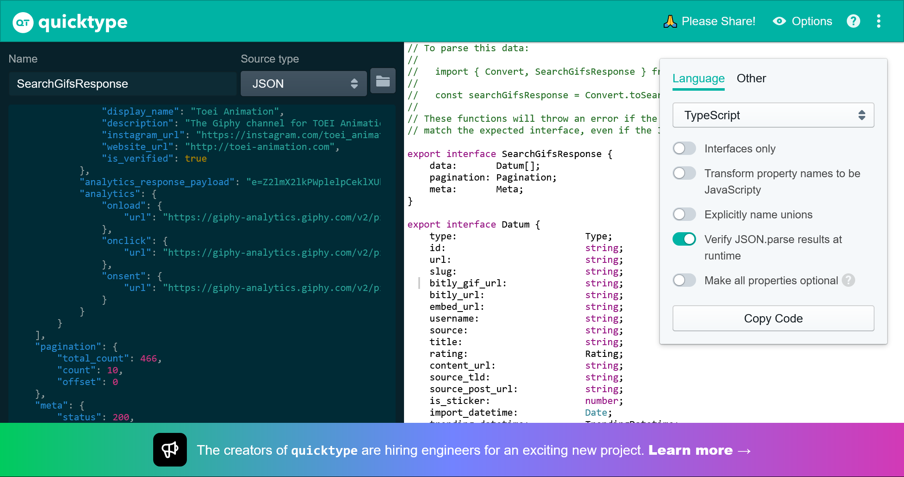

# GifsApp

This project was generated with [Angular CLI](https://github.com/angular/angular-cli) version 14.1.0.

## Development server

Run `ng serve` for a dev server. Navigate to `http://localhost:4200/`. The application will automatically reload if you change any of the source files.

## Code scaffolding

Run `ng generate component component-name` to generate a new component. You can also use `ng generate directive|pipe|service|class|guard|interface|enum|module`.

## Build

Run `ng build` to build the project. The build artifacts will be stored in the `dist/` directory.

## Running unit tests

Run `ng test` to execute the unit tests via [Karma](https://karma-runner.github.io).

## Running end-to-end tests

Run `ng e2e` to execute the end-to-end tests via a platform of your choice. To use this command, you need to first add a package that implements end-to-end testing capabilities.

## Further help

To get more help on the Angular CLI use `ng help` or go check out the [Angular CLI Overview and Command Reference](https://angular.io/cli) page.

## Como tipar una respuesta proveniente de una API
Como vimos en los ejercicios previos realizar este tipo de trabajo es complicado debido a que TS no nos recomienda palabras, atributos, etc. Por lo que somos propensos a cometer errores fácilmente, una alternativa sencilla es correr la petición en Postman y copiar toda la respuesta. 
Despues dirigirnos a [QuickType](https://app.quicktype.io/) y poner configuraciones como la siguiente:



Copiar la salida, pegar en nuestro proyecto y trabajarla.

## Localstorage y como usarlo

* Session storage: Todo lo que se almacene en ese sitio se borrará cuando cerremos el navegador por completo.

* LocalStorage: Ahí podremos guardan información por un periodo de tiempo más prolongado hasta que la PC o navegador decida eliminarlo. **Importante: El localstorage no debería guardar ningun tipo de información sencible**

Para guardar información en el localstorage no se necesita importar nada debido a que es natural de JS.

## Animate style CSS
Para agregar esta biblioteca podemos consultar [Animate.style](https://animate.style/) para ver los detalles, pero es tan sencillo como:

Importar en nuestro index.html:
```
<head>
  <link
    rel="stylesheet"
    href="https://cdnjs.cloudflare.com/ajax/libs/animate.css/4.1.1/animate.min.css"
  />
</head>

```

Y colocar el nombre de la clase en cualquier componente:

```<h1 class="animate__animated animate__bounce">An animated element</h1>
```

Puede convivir sin problemas con Bootstrap.